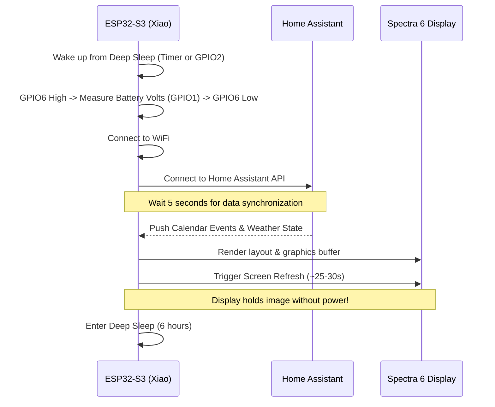

# ePaper Calendar + Weather Dashboard

A battery-powered 13.3" ePaper wall calendar and weather dashboard built around the **Seeed Studio XIAO ESP32-S3** and a **13.3" Spectra 6 E-Ink Display**. The dashboard wakes up periodically to pull current calendar events and weather forecasts from Home Assistant, updates its high-resolution 6-color display, and goes back to deep sleep to conserve battery.

---

## Technical Specifications

### Hardware

| Component | Detail |
|---|---|
| **Microcontroller** | Seeed Studio XIAO ESP32-S3 (8MB Flash, 8MB PSRAM in Octal mode @ 80MHz) |
| **Display** | 13.3" Spectra 6 E-Ink Display (1600 × 1200 resolution, landscape) |
| **Colors** | 6-color native palette (Black, White, Red, Yellow, Blue, Green) |
| **Driver Board** | EE02 Driver Board (Dual-controller SPI) |
| **Driver Component** | [esphome-bigink](https://github.com/acegallagher/esphome-bigink) custom ESPHome component (`seeed_epaper_spectra6`) |
| **Refresh Time** | ~25–30 seconds |

### Pinout Connections

The connections between the Seeed XIAO ESP32-S3 and the EE02 Driver Board / peripherals:

| Pin / GPIO | Function | Description |
|---|---|---|
| **GPIO7** | SPI CLK | SPI Serial Clock |
| **GPIO9** | SPI MOSI | SPI Master Out Slave In |
| **GPIO44** | CS Master | Chip Select for Master Controller |
| **GPIO41** | CS Slave | Chip Select for Slave Controller (dual-controller display) |
| **GPIO10** | DC | Data / Command control pin |
| **GPIO38** | Reset | Hardware Reset pin |
| **GPIO4** | Busy | Inverted busy pin (`inverted: true`, active low, pullup) |
| **GPIO43** | Power | Display power gate |
| **GPIO1** | Battery ADC | Analog input for battery voltage measurement |
| **GPIO6** | Battery ADC En | Switch control pin to enable/disable battery ADC divider (active high) |
| **GPIO2** | Wakeup | Interrupt pin used to wake ESP32-S3 early from deep sleep (active low) |
| **GPIO3** | Button D2 | Manual action button D2 (active low, pullup) |
| **GPIO5** | Button D4 | Manual action button D4 (active low, pullup) |

---

## How It Works

The dashboard is optimized for low-power operation. Rather than running continuously, it wakes up on a timer, fetches fresh data, updates the screen, and sleeps.



### 1. Boot & Measure Phase
When the device boots:
- It raises **GPIO6** to power the voltage divider network.
- It performs an ADC read on **GPIO1** to measure the battery voltage (`battery_voltage`).
- It calculates the battery percentage (`battery_percentage`) using a calibrated scale (3.2V = 0%, 4.2V = 100%).
- It pulls **GPIO6** low again immediately to prevent battery drain through the divider circuit.

### 2. Network & Sync Phase
- It attempts to connect to WiFi (SSID and password defined in `secrets.yaml`) with a 20-second timeout.
- Once connected, it initiates a connection to the Home Assistant API.
- If WiFi or API connections fail, the device defaults to rendering cached data and goes to sleep early to avoid keeping the radio on and draining the battery.
- If successful, it waits **5 seconds** for template sensors and text helpers to sync their values to the device.

### 3. Render & Sleep Phase
- The custom `seeed_epaper_spectra6` component processes the C++ drawing code in the display's `lambda`.
- The display is cleared to `WHITE`.
- Layout components (the grid, text, weather icons, countdown cards, and battery status) are rendered into the frame buffer.
- ESP32-S3 commands the EE02 driver to refresh the ePaper display.
- After refreshing is complete, the ESP32-S3 enters deep sleep for **6 hours** (`sleep_duration: 6h`).
- The running state is restricted to a maximum of **90 seconds** (`run_duration: 90s`) as a watchdog safeguard.

---

## Home Assistant Setup & Integration

To supply structured data to the ePaper calendar, Home Assistant uses three key files in `/ha-config/`:

### 1. Input Text Helpers (`input_text_epaper.yaml`)
Stores formatted text buffers that ESPHome reads:
- `input_text.epaper_weather_forecast_data`: A semi-colon separated string of upcoming weather conditions (e.g., `Tue|sunny|23|15;Wed|partlycloudy|27|18;Thu|sunny|27|19`).
- `input_text.epaper_calendar_line1` through `8`: Format strings for up to 8 calendar events.

### 2. Calendar Event & Weather Automation (`automations_epaper.yaml`)
Runs every 6 hours (or on HA startup) and performs the following:
1. Calls `calendar.get_events` for the calendar entity (defaults to `calendar.familj`) for the next 7 days.
2. Calls `weather.get_forecasts` for the weather entity (`weather.forecast_home`).
3. Formats and populates `input_text.epaper_weather_forecast_data` with the next 3 days of forecast.
4. Iterates through the fetched calendar events and formats up to 8 slots into structured strings using the format:
   `TITLE|START_DAY|END_DAY|START_HOUR|END_HOUR|ALLDAY`
   * `START_DAY`/`END_DAY`: Index from 0 to 6 (0 = Monday, ..., 6 = Sunday).
   * `START_HOUR`/`END_HOUR`: Decimal hours (e.g., `9.5` for 09:30, `13.75` for 13:45).
   * `ALLDAY`: `1` for all-day events, `0` for timed events.

### 3. Template Sensors (`template_sensors_epaper.yaml`)
Exposes state variables from HA to ESPHome:
- **ePaper Weather Temperature**: Current temperature.
- **ePaper Weather Humidity**: Current humidity level.
- **ePaper Weather Wind Speed**: Current wind speed.
- **ePaper Weather Forecast**: Current state of the weather forecast text helper.

---

## Display Layout Details

The screen resolution of **1600 × 1200** is divided into three functional areas:

```
+------------------------------------------------------------------------------------------------+
|  HEADER: [Day, DD Mon YYYY]                                                   [Clock - HH:MM]  |
+------------------------------------------------------------------------+-----------------------+
|                                                                        |                       |
|                                                                        |    CURRENT WEATHER    |
|                                                                        |     [Large Icon]      |
|                                                                        |        [23°C]         |
|                                                                        |   [Partly Cloudy]     |
|                                                                        |                       |
|                          7-DAY CALENDAR GRID                           +-----------------------+
|                              (MON - SUN)                               |                       |
|                                                                        |    2-DAY FORECAST     |
|                       Shows scheduled event blocks                     |  [Day 1]     [Day 2]  |
|                       color-coded and positioned                      |  Icon / Hi   Icon / Hi |
|                       by time and column.                              |  Lo / Cond   Lo / Cond |
|                                                                        |                       |
|                                                                        +-----------------------+
|                                                                        |                       |
|                                                                        |      COUNTDOWNS       |
|                                                                        |  - Birthday (X days)  |
|                                                                        |  - Christmas (Y days) |
|                                                                        |  - Halloween (Z days) |
|                                                                        |                       |
+------------------------------------------------------------------------+-----------------------+
|  FOOTER: Battery: 85% (3.95V) | Charging State                          Last updated: 12:00    |
+------------------------------------------------------------------------------------------------+
```

### Left Side: 7-Day Timetable Grid
- **Columns**: Monday through Sunday. Today's column is highlighted with a `RED` header; other days use a `BLUE` header.
- **Time Axis**: Left-aligned timestamps from `00:00` to `24:00` in 3-hour increments.
- **Time Indicator**: A thick `RED` horizontal line shows the current time of day across the current day's column.
- **Event Blocks**:
  - **Timed Events** are drawn in `BLUE` boxes positioned vertically according to their start and end decimal hours.
  - **All-Day Events** are drawn in `GREEN` boxes that span across their full date range.
  - Custom UTF-8 logic safely truncates long titles containing Swedish characters (`ÅÄÖåäö`).

### Right Side: Weather, Forecast & Countdowns
- **Current Weather**: Displays a large weather icon using the Material Design Icons font, large text temperature, condition string (e.g., "Thunderstorm"), and secondary sensor values (Humidity, Wind Speed).
- **2-Day Forecast Panels**: Side-by-side cards displaying day abbreviation, MDI icon, high temperature (in `RED`), low temperature (in `BLACK`), and condition label.
- **Countdowns Section**: Displays 5 custom events (e.g., birthdays, holidays) with left accent bars color-coded dynamically. Calculates the exact number of days remaining until the next occurrence and formats a badge (e.g., "TODAY!", "1 day", or "124 days").

### Footer Bar
- Displays battery capacity (`%` and voltage `V`) with color-coding (`GREEN` for healthy / charging, `YELLOW` for medium SoC, `RED` for low battery).
- Displays charging state (detects if battery voltage is above `4.25V` during USB connection).
- Shows timestamp of the last successful display update.

---

## Power Optimization & Battery Tips

> [!TIP]
> **Active Battery Saving Features:**
> - Captive portal and WiFi fallback APs have been disabled. If the device fails to connect to WiFi, it doesn't spin up a local access point (which drains massive battery); instead, it proceeds immediately to deep sleep.
> - The battery measurement circuit consumes no power during sleep because the voltage divider is switched off using the GPIO6 GPIO switch.

> [!WARNING]
> **Charging Detection:**
> - Charging detection uses a simple voltage threshold (`> 4.25V`). Active charging pushes the LiPo terminal voltage up.
> - For absolute precision, a hardware modification connecting the 5V USB rail to an unused GPIO via a voltage divider is recommended.
